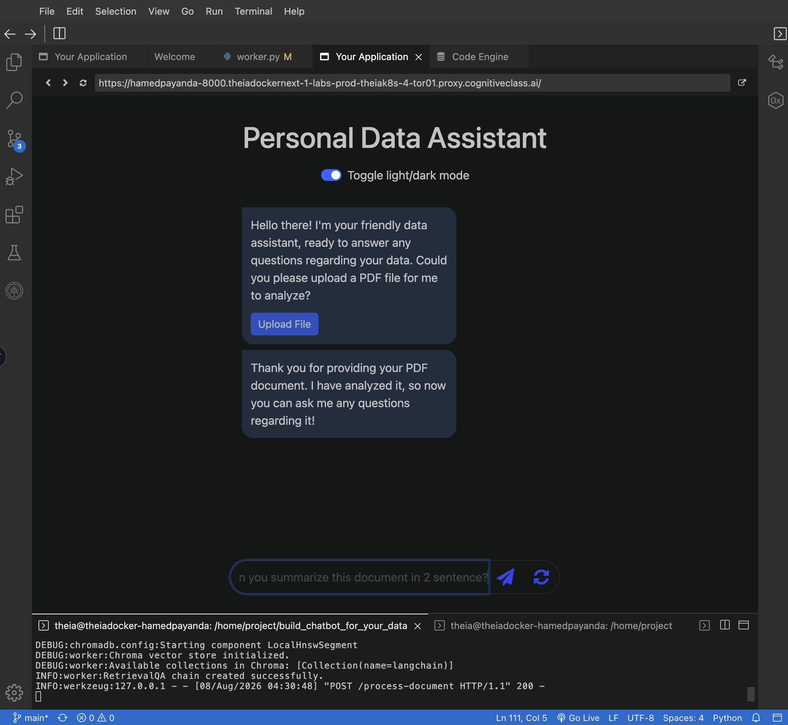
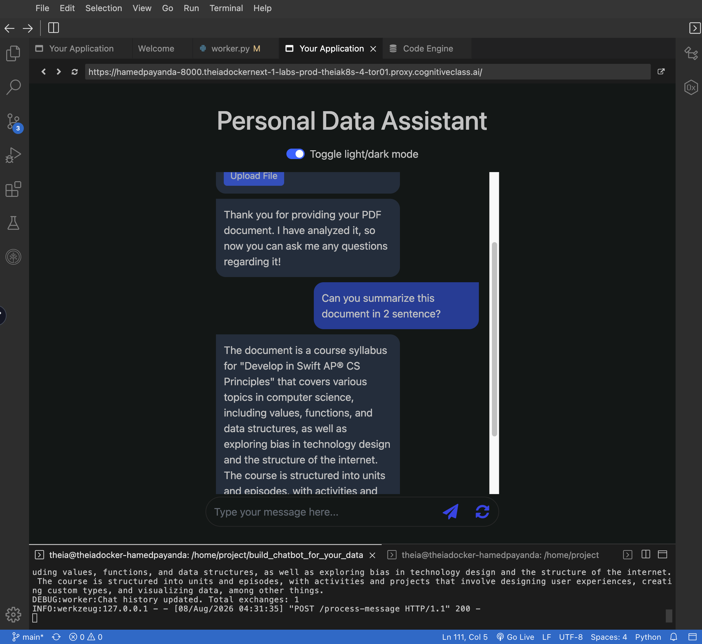
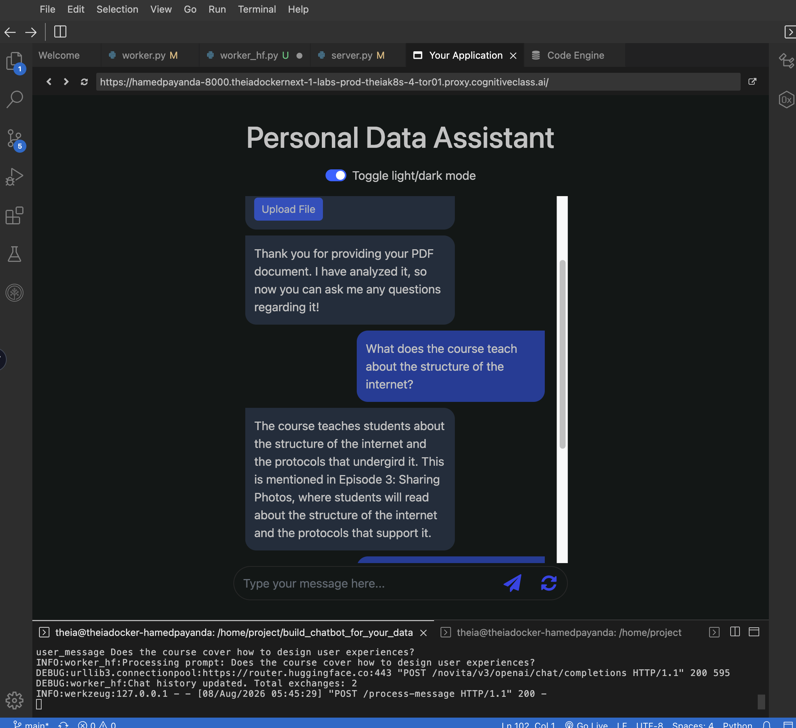
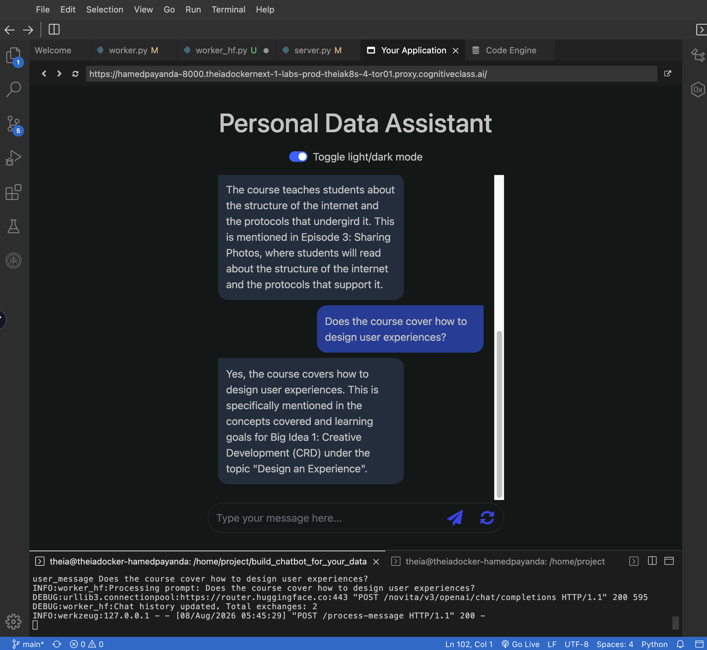
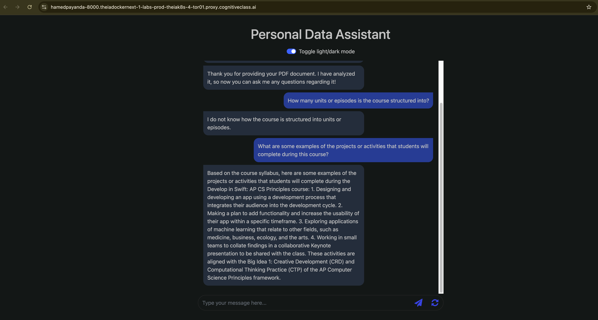
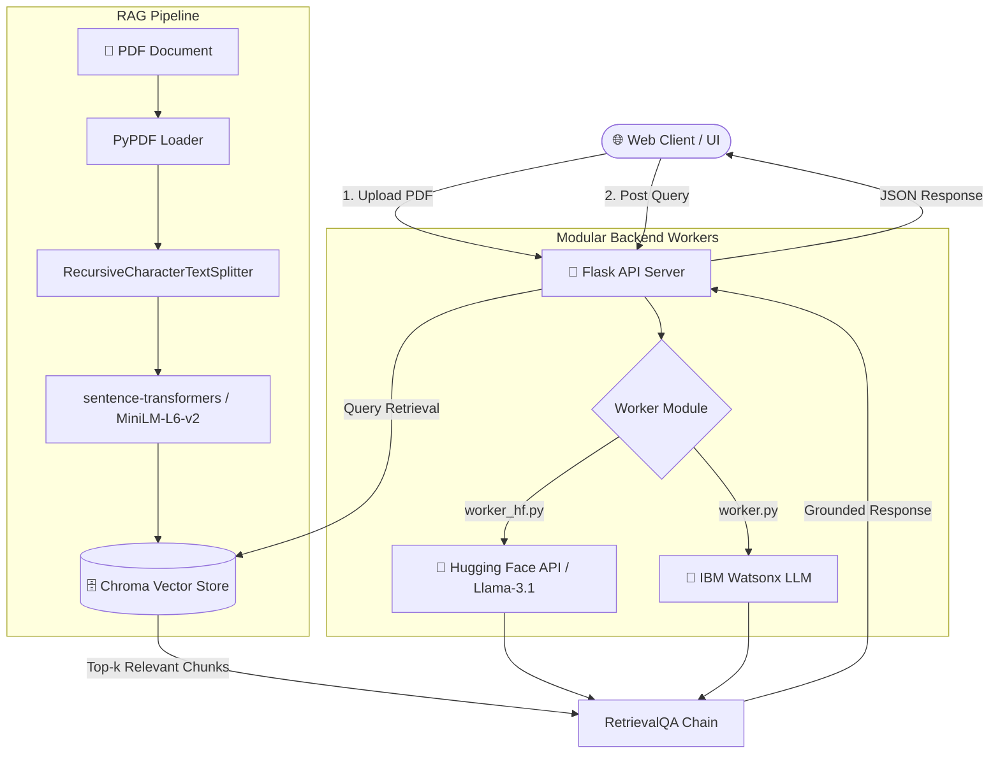

# 🤖 Personal Data Assistant — Enterprise RAG Document Chatbot

[](https://cognitiveclass.ai/)
[](https://github.com/HAMED-PAYANDA/langchain-document-assistant/actions)
[](https://opensource.org/licenses/Apache-2.0)
[](https://python.org)
[](https://www.langchain.com/)
[](https://flask.palletsprojects.com/)

An end-to-end **Retrieval-Augmented Generation (RAG)** web application capable of ingesting PDF documents, chunking and vectorizing text in real time, and delivering context-grounded answers. Built with **LangChain**, **Flask**, **Chroma DB**, and dual backend integration for **Hugging Face** (Llama-3.1-8B-Instruct) and **IBM Watsonx**.

---

## 📸 The Visual Proof & Demo Showcase

| Feature / Step | Screenshot Preview | Description |
| :--- | :--- | :--- |
| **1. PDF Ingestion & Analysis** |  | Uploading and parsing `AP CS Principles Syllabus.pdf` with Chroma vector storage initialization. |
| **2. Document Summarization** |  | Asking the chatbot to summarize the uploaded document into a concise 2-sentence breakdown. |
| **3. Contextual RAG Retrieval** |  | Asking specific structural questions about the internet, pulling directly from *Episode 3*. |
| **4. Deep Context Extraction** |  | Querying user experience design principles grounded in *Big Idea 1: Creative Development*. |
| **5. Anti-Hallucination Guardrails** |  | Demonstrating strict context constraints: admitting unknown facts vs. extracting project lists. |

---

## 🏗️ System Architecture


## ✨ Key Features

* 🎯 **Grounded RAG Pipeline:** Eliminates AI hallucinations by restricting response generation strictly to the uploaded PDF context chunks ($k=3$).
* 🔄 **Dual Backend Support:** Modular worker design allowing seamless switching between the **Hugging Face Inference API** (Llama 3.1) and **IBM Watsonx**.
* ⚡ **Real-time Vector Search:** Fast, in-memory vector database powered by **ChromaDB** and `sentence-transformers/all-MiniLM-L6-v2`.
* 🌐 **Full-Stack REST Architecture:** Responsive, asynchronous JavaScript frontend communicating with a lightweight **Flask** web backend.
* 🐳 **Containerized & CI/CD Ready:** Fully packaged via **Docker** and automatically built and published to the **GitHub Container Registry (GHCR)** using GitHub Actions.
    
## 🛠️ Core Tech Stack

**Languages & Frontend:**<br>


**AI & Machine Learning:**<br>


**Backend & Vector Storage:**<br>


**DevOps & Deployment:**<br>


## 📁 Repository Structure
```text
langchain-document-assistant/
├── .github/
│   └── workflows/
│       └── docker-publish.yml     # GitHub Actions CI/CD workflow
├── static/
│   ├── script.js                 # Async frontend REST logic
│   └── style.css                 # Dark/Light theme styles
├── templates/
│   └── index.html                # Application UI template
├── AP CS Principles Syllabus.pdf  # Sample test document
├── Dockerfile                    # Container configuration
├── LICENSE                       # Apache-2.0 License
├── README.md                     # Repository documentation
├── requirements.txt              # Frozen dependency list
├── server.py                     # Primary Flask REST server
├── worker.py                     # IBM Watsonx LLM worker logic
├── worker_hf.py                  # Hugging Face LLM worker logic
├── demo6.png                     # Visual proof screenshot
├── demo7.png                     # Visual proof screenshot
├── demo8.png                     # Visual proof screenshot
├── demo9.png                     # Visual proof screenshot
└── demo10.png                    # Visual proof screenshot
```

## ⚙️ Local Setup & Execution

Option 1: Running via Local Python Environment
	1.	Clone the Repository:
  ```bash
git clone [https://github.com/HAMED-PAYANDA/langchain-document-assistant.git](https://github.com/HAMED-PAYANDA/langchain-document-assistant.git)
cd langchain-document-assistant
```

  2.	Create and Activate a Virtual Environment:
  ```bash
python3 -m venv my_env
source my_env/bin/activate
```

  3.	Install Dependencies:
  ```bash
pip install --no-cache-dir -r requirements.txt
```

  4.	Configure API Token:
  ```bash
In worker_hf.py, replace the placeholder with your active Hugging Face token:
os.environ["HUGGINGFACEHUB_API_TOKEN"] = "YOUR_HUGGINGFACE_TOKEN"
```

  5.	Start the Flask Server:
  ```bash
python3 server.py
```

Access the web application at http://localhost:8000.

Option 2: Running via Docker Container
	1.	Build the Docker Image:
  ```bash
docker build --no-cache -t langchain-document-assistant .
```
  2.	Run the Container:
  ```bash
docker run -p 8000:8000 langchain-document-assistant
```

Option 3: Pulling from GitHub Container Registry (GHCR)
You can run the pre-built container directly from GitHub Packages without local compilation:
```bash
docker pull ghcr.io/hamed-payanda/langchain-assistant:latest
docker run -p 8000:8000 ghcr.io/hamed-payanda/langchain-assistant:latest
```

## How to get watsonx API key and Project ID

Here, we initialize a language model and its embeddings. Here's a brief description of each section of the script:

- API and Project ID: Watsonx_API and Project_id are variables storing the API key and project ID required to access IBM's cloud services.


- WatsonX LLM parameters Initialization: Inside the function, a dictionary named params is created, which holds various parameters like maximum and minimum number of tokens to generate, temperature (controlling randomness), and others for configuring the generation behavior of the language model.

- Credentials: A dictionary named credentials is defined with the URL of IBM's cloud service and the API key to authenticate requests to the service.
- LLM Initialization: A model object, `LLAMA2_model`, is created using the Model class, which is initialized with a specific model ID, credentials, parameters, and project ID. Then, an instance of WatsonxLLM is created with `LLAMA2_model` as an argument, initializing the language model hub `llm_hub`.


We also initialize embeddings. The embeddings are used to represent text data in a form that machines can understand. They convert human-readable text into numbers (vectors) that capture the semantic meaning of the text.

- The embeddings are initialized using a class called `HuggingFaceInstructEmbeddings` pre-trained model named `sentence-transformers/all-MiniLM-L6-v2` list of leaderboard of embeddings are available [here](https://huggingface.co/spaces/mteb/leaderboard). This embedding model has shown a good balance in both performance and speed.

## Get Your Watsonx API and Project ID
Since watsonx is an IBM Cloud service, credentials such as an API key and a project ID are required when accessing from the outside. 

To access the credentials, we've provided a special code for you to claim a USD 200 credit on IBM Cloud at no charge! Here's how to get started:
1. **IBM Cloud Trial Access:**
- Proceed to the "IBM Cloud Trial" section for the unique code and detailed instructions.

- Follow these instructions to sign up for a non-expiring Lite account at IBM Cloud, which includes the USD 200 credit.

2. **Create Your Watsonx Project:**
- Sign in to [IBM watsonx](https://dataplatform.cloud.ibm.com/registration/stepone?utm_source=skills_network&utm_content=in_lab_content_link&utm_id=Lab-test1_v1_1702536549&context=wx&apps=data_science_experience%2Cwatson_data_platform%2Ccos) and [create a project](https://dataplatform.cloud.ibm.com/projects/?utm_source=skills_network&utm_content=in_lab_content_link&utm_id=Lab-test1_v1_1702536549&context=wx).

- Inside your project on watsonx, navigate to `Manage` > `General` to find your project ID for your later use.

3. **Associate Watson Machine Learning Service:**
After you create a project, you can go to the project’s `Manage` tab > select the `Services and integrations` page > click `Associate Service` > add the `Watson Machine Learning` service to it.

4. **Generate IBM Cloud User API Key:**
Lastly, you can follow the below demonstration to create/get your [IBM Cloud user API key](https://cloud.ibm.com/iam/apikeys?utm_source=skills_network&utm_content=in_lab_content_link&utm_id=Lab-test1_v1_1702536549). Be sure to write your API key down somewhere right after you create it, because you won’t be able to see it again!


5. **Update Code:** 
In server.py, switch the import to import worker as worker, and set your credentials in worker.py:
```python
Watsonx_API = "YOUR_WATSONX_API_KEY"
Project_id = "YOUR_PROJECT_ID"
```
📜 License
Distributed under the Apache-2.0 License. See LICENSE for more information.

👤 Author
Hamed Payanda
•	GitHub: @HAMED-PAYANDA
•	Completed as part of the IBM AI Developer Program


